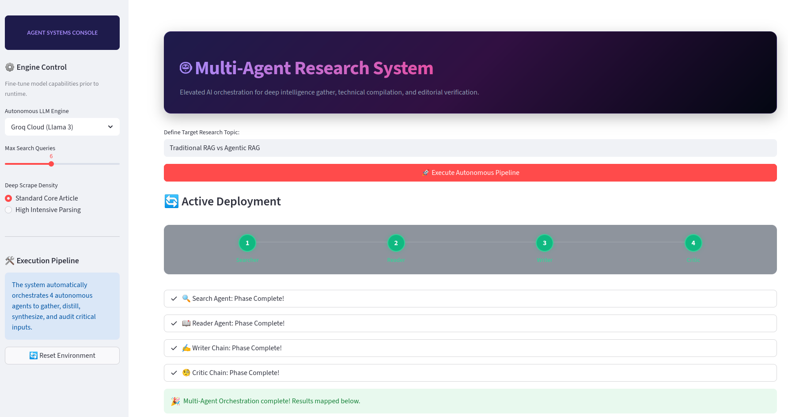
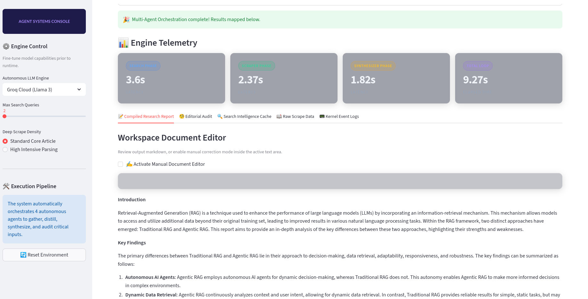
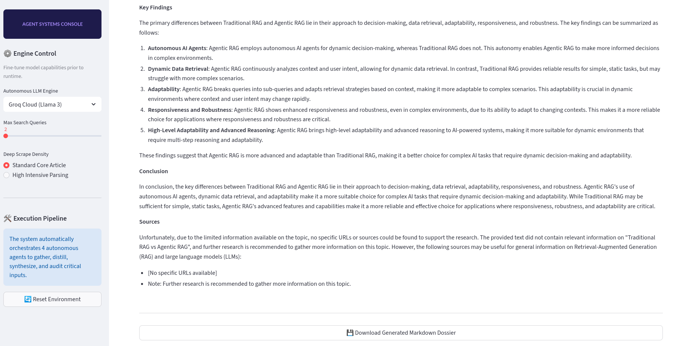

# 🤖 Multi-Agent Research Studio

An elevated AI orchestration studio built with **Streamlit** and **LangGraph** designed for deep web intelligence gathering, technical compilation, and automated editorial verification.

This system leverages **4 cooperative autonomous agents** and chained workflows to scout, scrape, synthesize, and audit comprehensive research dossiers on any given topic.

---

# 📸 App UI Live Dashboard

Below is the live execution flow of the Multi-Agent Pipeline. The interface features:

* Real-time telemetry analytics
* Dynamic node status tracking
* Interactive workspace editor
* Multi-agent execution monitoring
* Glassmorphic UI components





---

# 🤝 System Orchestration Flow

```text
[ User Input Topic ]
         │
         ▼
 1. 🔍 Search Agent
    └── Scouts Tavily API & caches discovery links
         │
         ▼
 2. 📖 Reader Agent
    └── Scrapes high-yield URLs using BeautifulSoup
         │
         ▼
 3. ✍️ Writer Chain
    └── Synthesizes raw context into structured Markdown
         │
         ▼
 4. 🧐 Critic Chain
    └── Audits formatting, structure, and factual citations
```

---

# 🧠 Core Features

* ⚡ Multi-Agent Research Automation
* 🌐 Real-Time Web Intelligence Gathering
* 🧩 LangGraph State-Based Orchestration
* 🛠️ Custom LangChain Tooling
* 📄 Automated Markdown Report Generation
* 🧐 AI Editorial Verification & Critique
* 📊 Live Agent Telemetry Dashboard
* 🎨 Modern Streamlit Glassmorphism UI
* 🔁 Stateful Workflow Memory
* 📚 Structured Research Compilation

---

# 🛠️ Step-by-Step Architecture Guide

---

## Step 1 — Environment Setup

We utilize **uv** for ultra-fast package management and isolated dependency resolution.

This ensures:

* Faster installations
* Clean environments
* Reduced dependency conflicts
* Better reproducibility for AI workflows

---

## Step 2 — Custom Tool Integrations (`tools.py`)

We implement custom tools using LangChain’s `@tool` decorator.

### 🔍 `web_search`

Connects directly to the Tavily API to retrieve up-to-date web intelligence on the requested topic.

```python
@tool
def web_search(query: str):
    ...
```

### 📖 `scrape_url`

Receives a target URL, downloads the HTML DOM, parses content using BeautifulSoup, and extracts structured textual context.

```python
@tool
def scrape_url(url: str):
    ...
```

### Tooling Responsibilities

| Tool            | Purpose                    |
| --------------- | -------------------------- |
| `web_search`    | Discovery & indexing       |
| `scrape_url`    | Deep content extraction    |
| `BeautifulSoup` | DOM parsing                |
| `Tavily API`    | Real-time web intelligence |

---

# 🤖 Step 3 — Core Agents Setup (`agents.py`)

This layer contains the cognitive processing units of the system.

---

## 🔍 Search Agent

Built using:

* `create_react_agent`
* `AgentExecutor`

Responsibilities:

* Intelligent query decomposition
* Strategic search execution
* Retrieval prioritization
* Link discovery caching

---

## 📖 Reader Agent

Focused exclusively on content ingestion and contextual extraction.

Bound directly to:

* `scrape_url`
* HTML parsing pipelines
* Context refinement logic

---

## ✍️ Writer Chain

Implements the modern **LCEL (LangChain Expression Language)** pipeline architecture.

```text
Prompt → LLM → StrOutputParser()
```

### LCEL Flow

```python
writer_chain = (
    prompt
    | llm
    | StrOutputParser()
)
```

Responsibilities:

* Context synthesis
* Markdown structuring
* Technical summarization
* Long-form report generation

---

## 🧐 Critic Chain

An independent verification unit responsible for auditing generated reports.

### Responsibilities

* Citation verification
* Formatting inspection
* Structural consistency checks
* Hallucination detection
* Improvement recommendations

### Example Output

```json
{
  "score": 9.1,
  "issues": [],
  "recommendations": [
    "Add more citations",
    "Improve section transitions"
  ]
}
```

---

# ⚙️ How Tool Invocation Works Internally

LangGraph manages autonomous tool execution natively.

## Execution Lifecycle

1. Tools are registered as callable Python functions
2. The LLM emits structured `tool_calls`
3. LangGraph intercepts tool requests
4. Local Python functions execute automatically
5. Results are injected back into the shared conversation state

---

## Example Internal Tool Call

```json
{
  "tool": "web_search",
  "arguments": {
    "query": "Latest advancements in AI agents"
  }
}
```

---

# 🧩 Step 4 — Central Supervisor (`pipeline.py`)

The pipeline orchestrates the entire workflow through shared state injection.

---

## Shared State Architecture

```python
state = {
    "topic": "",
    "search_results": [],
    "documents": [],
    "draft": "",
    "critique": ""
}
```

---

## Sequential State Injection Example

```python
search_results = search_agent.invoke({
    "messages": [("user", "Find information about AI agents")]
})

state["search_results"] = search_results["messages"][-1].content
```

---

## Pipeline Responsibilities

* Agent sequencing
* State persistence
* Error recovery
* Telemetry logging
* Workflow synchronization

---

# 🧪 Step 5 — Command Line Validation

Before launching the UI, validate all pipeline connections programmatically.

```bash
uv run pipeline.py
```

This verifies:

* Agent execution
* API connectivity
* Tool invocation
* State transitions
* Logging outputs

---

# 🖥️ Step 6 — Interactive Web Interface (`app.py`)

The Streamlit dashboard delivers a polished orchestration studio experience.

---

## UI Features

* 🌌 Glassmorphic interface
* 📊 Real-time execution telemetry
* 🧠 Agent activity monitor
* 📄 Workspace markdown editor
* 🔄 Live workflow visualization
* 🧩 Stateful session management

---

# 📂 Recommended Project Structure

```text
MultiAgent-Research-Studio/
│
├── agents.py
├── tools.py
├── pipeline.py
├── app.py
├── requirements.txt
├── .env
│
├── assets/
│   └── dashboard_screenshot.png
│
├── outputs/
│   └── generated_report.md
│
└── README.md
```

---

# ⚙️ Project Setup & Installation

---

## 1️⃣ Clone the Repository

```bash
git clone https://github.com/your-username/MultiAgent-Research-System.git

cd MultiAgent-Research-System
```

---

## 2️⃣ Environment Setup (Using `uv`)

Install all dependencies:

```bash
uv pip install -r requirements.txt
```

---

# 🔑 3️⃣ API Key Configuration

Create a `.env` file inside the root directory:

```env
GROQ_API_KEY="your_groq_api_key_here"

TAVILY_API_KEY="your_tavily_api_key_here"
```

---

# 🚀 4️⃣ Launch the Streamlit Dashboard

```bash
uv run streamlit run app.py
```

---

# 📦 Example Dependencies

```txt
streamlit
langchain
langgraph
langchain-community
langchain-core
langchain-groq
beautifulsoup4
requests
python-dotenv
tavily-python
```

---

# 🔬 Future Improvements

* 🧠 Long-Term Vector Memory
* 📚 RAG-based Document Recall
* 🛰️ Autonomous Research Planning
* 🔗 Multi-Source Citation Graphs
* 📈 Research Quality Scoring
* 🎙️ Voice-Based Research Input
* 🧪 Multi-LLM Consensus Validation
* 🗂️ PDF & Arxiv Parsing Pipelines
* 🧵 Concurrent Agent Execution
* ☁️ Cloud Deployment Support

---

# 🧠 Tech Stack

| Layer         | Technology    |
| ------------- | ------------- |
| Frontend      | Streamlit     |
| Orchestration | LangGraph     |
| Agents        | LangChain     |
| Parsing       | BeautifulSoup |
| LLM Provider  | Groq          |
| Search Engine | Tavily        |
| Environment   | uv            |
| Language      | Python        |

---

# 📜 License

This project is licensed under the **MIT License**.

---

# 🌟 Acknowledgements

Special thanks to the open-source ecosystem powering modern AI orchestration:

* LangChain
* LangGraph
* Streamlit
* Tavily
* BeautifulSoup
* Python OSS Community

---

# ⭐ Support the Project

If you found this project useful:

* ⭐ Star the repository
* 🍴 Fork the project
* 🧠 Contribute new agent capabilities
* 🚀 Share your research workflows

---

# 🧠 Final Vision

The future of research systems lies in:

> Autonomous agents capable of searching, reasoning, validating, and synthesizing knowledge collaboratively.

This project serves as a foundational framework toward building scalable AI research operating systems.
